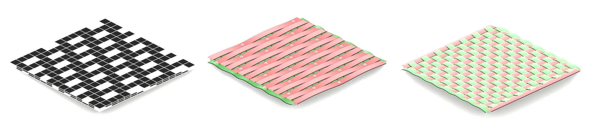

# Alberaic Framework for Generating Infinite Polyhdral Frames Using Nonwoven Fabric Patterns

1. [Installation](#installation)
2. [Shape Generation Controls](#shape-generation-controls)
3. [Rendering](#rendering)
4. [Citation](#citation)




In this repository you can find the implementation of the framework described in "Volumetric nonwoven structures: An algebraic framework for systematic design of infinite polyhedral frames using nonwoven fabric patterns"

## Installation

To use these blender files you need to have a stable release of blender 4.3+, which can be found [here](https://builder.blender.org/download/daily/).

## Shape Generation Controls

Shape generator can be controlled through the Geometry Nodes modifier inputs that can be accessed through the Blender interface:


There are in total 9 shape generators, each input is explained within the files through a README text embedded inside the file. It should be visible with main workspace, if not open up the text editor and choose it to view controls for the shapes.

All the description for the controls are given below

### volumetric_nonwoven_NSD INPUTS:
```N```: Base 10 representation of the binary string {0,1}^k represents, the base size of a column is determined by log2(N)

```S```: shift amount for each row

```D```: shift amound in X direction for each layer

```Z```: number of dual layers since all layers should have a warp and weft pair, total number of layers is N*2

```Thickness```: Controlls the thickness of the connections

```Single/Tiled```: Tiles the structure to a 3x3x3 domain

```Subdivision Level```: Subdivision iterations applied after construction

```Wall Thickness```: Controlls the wall thickness of the connections

    
### volumetric_nonwoven_ABCD INPUTS:
```X```: 
    number of elements in X direction for the fundamental domain

```Y```: number of elements in Y direction for the fundamental domain

```Z```: number of elements in Z direction for the fundamental domain

```A```: Number of consecutive no connections for a single column

```B```: Number of consecutive connections for a single column

```C```: Shift amount for next row

```D1```: Shift amount for layers in X direction

```Pipe Width```: Width of the pipes

```Shell Thickness```: Controls the thickness of walls

```Tile 3x3```: Tiles the structure to 3x3x3 cube lattice

```CC Subdivision Level```: Subdivision iterations applied after construction

```Skeleton Switch```: Adds the skeletal structure to the model
    
### handlebody_surface_volumetric_nonwoven_ABCD INPUTS:
```X```: number of elements in X direction for the fundamental domain

```Y```: number of elements in Y direction for the fundamental domain

```Z```: number of elements in Z direction for the fundamental domain

```A```: Number of consecutive no connections for a single column

```B```: Number of consecutive connections for a single column

```C```: Shift amount for next row

```D1```: Shift amount for layers in X direction

### grunbaum_shephard_matrix INPUTS:
```x```: number of elements in X direction

```y```: number of elements in Y direction 

```z```: number of elements in Z direction 

```A```: Number of consecutive 0s

```B```: Number of consecutive 1s

```C```: Shift amount for next row

```Y```: Scale of the structure

```D1```: Shift amount for layers in X direction

```D2```: Shift amount for layers in Y direction
    
### abc_nonwoven INPUTS:
```x```: number of elements in X direction 

```y```: number of elements in Y direction 

```A```: Number of consecutive free elements

```B```: Number of consecutive connected elements

```C```: Shift amount for next row

```Y```: Scale of the structure
    
### abc_woven INPUTS:
```x```: number of elements in X direction 

```y```: number of elements in Y direction 

```A```: Number of consecutive up crossings

```B```: Number of consecutive down crossings

```C```: Shift amount for next row

```Z```: Z-Scale of the weave

```Y```: Scale of the structure

### adic_shift_random_nonwoven INPUTS:
```NX```: number of elements in X direction for the fundamental domain

```NY```: number of elements in Y direction for the fundamental domain

```NZ```: number of elements in Z direction for the fundamental domain

```Thickness```: Controlls the thickness of the connections

```Subdivision Level```: Subdivision iterations applied after construction

```Seed```: seed used for the random number
    
### adic_shift_nonwoven INPUTS:
```NX```: number of elements in X direction for the fundamental domain

```NY```: number of elements in Y direction for the fundamental domain

```NZ```: number of elements in Z direction for the fundamental domain

```Adic Number```: Adic number used for the first row. If the number is less than 10^(NX-1) then the number contains leading 0. If the number is greater then ```10```*NX then the only firts NX digits of the number is considered

```Shift1```: shift applied for each row

```Shift2```: shift applied for each layer
    
### probabilistic_nonwoven INPUTS:
```NX```: number of elements in X direction for the fundamental domain

```NY```: number of elements in Y direction for the fundamental domain

```NZ```: number of elements in Z direction for the fundamental domain

```P_X```: Probability of not having connection for X direction

```P_Y```: Probability of not having connection for Y direction

```P_Z```: Probability of not having connection for Z direction

```Thickness```: Controlls the thickness of the connections

```Subdivision Level```: Subdivision iterations applied after construction

```Disable``` X Connections: Disables X Connections

```Disable``` Y Connections: Disables Y Connections

```Disable``` Z Connections: Disables Z Connections

```Seed```: seed used for the random number


## Rendering

To get different rendering of the shape you can use Blender's features which can be accessed through the viewport interface.

## Citation

```bibtex
@article{yildiz2024adicVolumetricNonwovens,
    title = {Volumetric nonwoven structures: An algebraic framework for systematic design of infinite polyhedral frames using nonwoven fabric patterns},
    journal = {Computers & Graphics},
    volume = {122},
    pages = {103979},
    year = {2024},
    issn = {0097-8493},
    doi = {https://doi.org/10.1016/j.cag.2024.103979},
    url = {https://www.sciencedirect.com/science/article/pii/S0097849324001146},
    author = {Tolga Yildiz and Ergun Akleman},
    keywords = {Volumetric nonwoven structures, Shape algebra, Shape modeling and design, P-adic numbers}
}
```